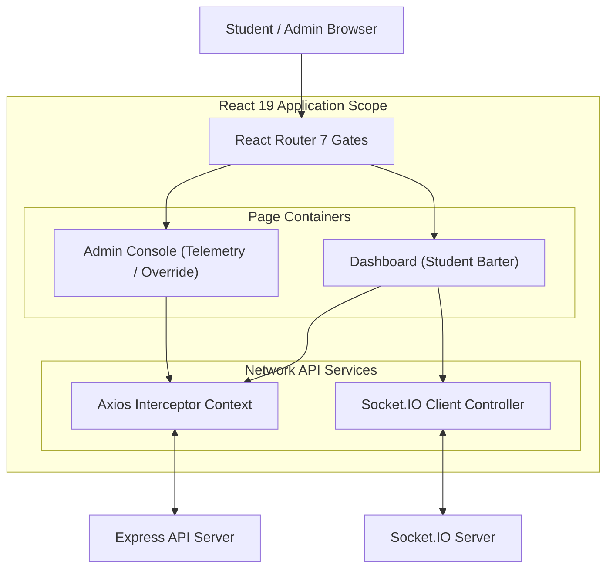
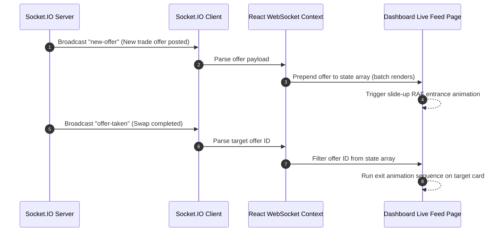

# 📐 KRSwitch Frontend — Component Topology & Client States

This document details the interface structures, routing gates, WebSocket event synchronization, and performance optimizations inside the React 19 / Vite 7 client.

---

## 1. Client Service Boundaries

The frontend application coordinates pages, standard UI components, state engines, WebSockets, and secure API layers:

---

## 2. Real-Time View Synchronization

The Socket.IO Client maps real-time server broadcasts directly to local React state hook matrices, preventing page flushes:

> [!NOTE]
> **Dynamic Reconnection**: If the network connection drops, the header light status immediately switches to `🔴 Reconnecting` and attempts to reconnect. Upon reconnection, the client automatically requests a new socket token and re-establishes auth.

---

## 3. Client Performance Optimizations

To maintain a fluid 60fps across highly concurrent schedule exchanges, the frontend implements several structural optimization rules:

*   **Linear Tooltip Interpolation (LERP)**: Tooltips and schedule graph overlays use linear interpolation coordinates to track mouse movements rather than sudden pixel changes.
*   **useMemo Filter Guards**: Complex class timetables and student directories are memoized to avoid expensive sorting and matching operations during real-time WebSocket updates.
*   **useCallback Handlers**: Trade confirmation callbacks and drawer toggles are memoized using `useCallback` hooks to prevent parent re-renders.

> [!TIP]
> **Batching States**: WebSocket state modifications update multiple states in a single render cycle, avoiding layout thrashing.

---

## 👥 Developer Credits

This project is engineered and maintained with ❤️ by:
1. **Gilang Muhamad Widiagung**
2. **Azka Julian**
3. **Muhammad Arifaushan**
