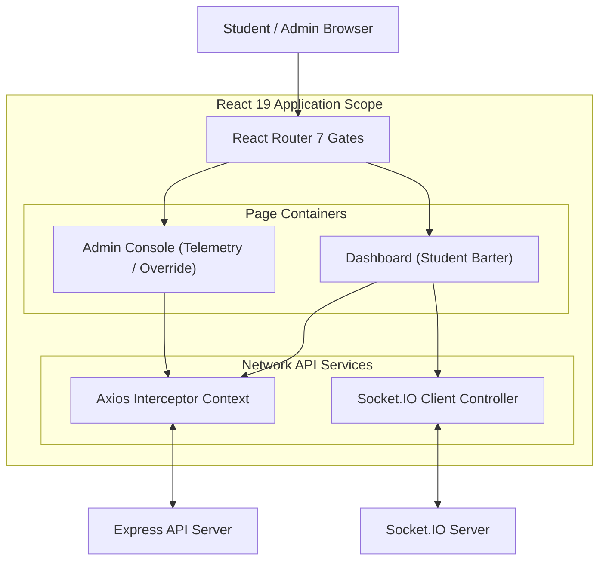

# Architecture & UI

## 1. Client Service Boundaries

The frontend application coordinates pages, standard UI components, state engines, WebSockets, and secure API layers:

## 2. User Interface & Views

### Student Barter Dashboard
*   **Parallel Classes Grid**: Lists parallel sections alongside enrollment structures, slot indicators, and schedule overlaps.
*   **Live Barter Feed**: Real-time trade listings that update dynamically via WebSockets.
*   **Filters**: Focuses views on compatible sections and active offers.
*   **Schedule Conflict Guards**: Alerts users of time overlaps prior to confirming swaps.

### Admin Management Center
*   **System Telemetry**: Displays counts of online users, active listings, transaction success ratios, and system audit logs in real time.
*   **Student Registry & Management**: Searchable databases containing registration logs, active trades, and course drops.
*   **Transactional CSV Imports**: Drag-and-drop file inputs designed to import schedules and registries, featuring validation previews.
*   **Override Wizard**: Steps operators through manual enrollment swaps, checking conflicts and cleaning stale listings automatically.
*   **SuperAdmin Tab**: Manage administrative permissions, edit details, toggle active/disabled flags, and trigger a master system reset.

## 3. Client Performance Optimizations

To maintain a fluid 60fps across highly concurrent schedule exchanges, the frontend implements several structural optimization rules:

*   **Linear Tooltip Interpolation (LERP)**: Tooltips and schedule graph overlays use linear interpolation coordinates to track mouse movements rather than sudden pixel changes.
*   **useMemo Filter Guards**: Complex class timetables and student directories are memoized to avoid expensive sorting and matching operations during real-time WebSocket updates.
*   **useCallback Handlers**: Trade confirmation callbacks and drawer toggles are memoized using `useCallback` hooks to prevent parent re-renders.
*   **State Batching**: WebSocket state modifications update multiple states in a single render cycle, avoiding layout thrashing.
