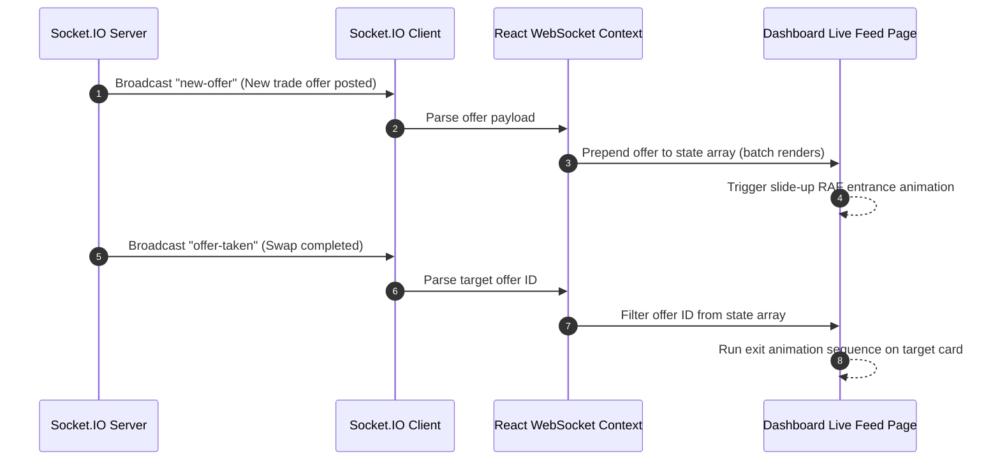

# WebSockets & Real-Time

## Real-Time View Synchronization

The Socket.IO Client maps real-time server broadcasts directly to local React state hook matrices, preventing page flushes:

> [!NOTE]
> **Dynamic Reconnection**: If the network connection drops, the header light status immediately switches to `🔴 Reconnecting` and attempts to reconnect. Upon reconnection, the client automatically requests a new socket token and re-establishes auth.
